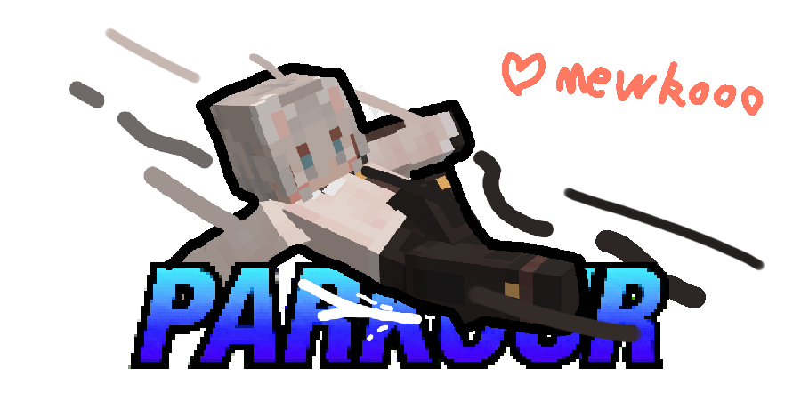

# 模组介绍（[EN version](#english)）

**简单跑酷（Parkour）**，一个更简单、更易上手的新兴跑酷模组。

## 📖 模组提供的特性

- 爬行；
- 滑铲/闪避；
- 速过（侧越）；
- 墙滑；
- 墙跑；
- 墙爬；
- 垂挂；
- 蹬墙跳/撑墙跳；
- 落地翻滚；
- 移动机制改革；
- 攀爬机制改革；
- 游泳机制改革；
- 水中推进；
- 以上功能均已提供配置文件开启/关闭或调整数值，更多特性正在开发中...

## 👍 鸣谢与归属

本项目的开发离不开开源社区的贡献，部分代码逻辑参考或派生自以下项目。特此鸣谢：

### [MovesLikeMafuyu (高速企鹅)](https://github.com/Mafuyu404/MovesLikeMafuyu)

作者： 瑞雪真冬

开源协议： GPL-3.0 License

### [better-climbing (更好的攀爬)](https://github.com/artemisSystem/better-climbing)

作者： artemisSystem

开源协议： CC0-1.0 License

### [ParCool！（跑酷！）](https://github.com/alRex-U/ParCool)

作者： alRex_U

开源协议： GPL-3.0 License

## 📄 版权与许可声明

本项目采用**分离的许可机制**进行授权：

### 源代码 (Source Code)：

采用 **[GNU General Public License v3.0 (GPL-3.0)](LICENSE)** 协议开源。

### 多媒体资产 (Media Assets)：

项目中的所有非代码类资产（包括但不限于模型、材质贴图、音效及UI设计），均采用 **[知识共享 署名-非商业性使用-相同方式共享 4.0 国际许可协议 (CC BY-NC-SA 4.0)](https://creativecommons.org/licenses/by-nc-sa/4.0/legalcode.zh-hans)** 授权。

**未经特别授权，严禁将本项目的多媒体资产用于任何商业盈利用途。**

## 🤝 贡献

欢迎提交 [Issue](https://github.com/Moflop/Parkour/issues) 和 [Pull Request](https://github.com/Moflop/Parkour/pulls)！

## 📧 联系方式

如有问题或建议，请通过 [Issue](https://github.com/Moflop/Parkour/issues) 联系我们。

# Parkour Mod

**Parkour** is a simpler and more accessible emerging parkour mod.

## 📖 Features Provided by the Mod

- Crawling;
- Sliding/Dodging;
- Speed Vault;
- Wall Sliding;
- Wall Running;
- Wall Climbing;
- Arm Hanging;
- Wall Jumping;
- Landing Roll;
- Movement Mechanics Overhaul;
- Climbing Mechanics Overhaul;
- Swimming Mechanics Overhaul;
- Swimming Boost;
- All the above features can be enabled/disabled or customized via configuration files, and more features are currently under development...
  

## 👍 Acknowledgements and Attribution

This project would not have been possible without the contributions of the open-source community. Some code logic is referenced or derived from the following projects. Special thanks to:

### [MovesLikeMafuyu](https://github.com/Mafuyu404/MovesLikeMafuyu)

Author: 瑞雪真冬

License: GPL-3.0 License

### [better-climbing](https://github.com/artemisSystem/better-climbing)

Author: artemisSystem

License: CC0-1.0 License

### [ParCool!](https://github.com/alRex-U/ParCool)

Author: alRex_U

License: GPL-3.0 License

## 📄 Copyright and License Statement

This project adopts a **split licensing mechanism**:

### Source Code:

Licensed under the **[GNU General Public License v3.0 (GPL-3.0)](LICENSE)**.

### Media Assets:

All non-code assets in the project (including but not limited to models, textures, sound effects, and UI designs) are licensed under the **[Creative Commons Attribution-NonCommercial-ShareAlike 4.0 International License (CC BY-NC-SA 4.0)](https://creativecommons.org/licenses/by-nc-sa/4.0/legalcode)**.

**Without explicit authorization, the media assets of this project are strictly prohibited for any commercial use.**

## 🤝 Contributing

Issues and Pull Requests are welcome at [Issues](https://github.com/Moflop/Parkour/issues) and [Pull Requests](https://github.com/Moflop/Parkour/pulls)!

## 📧 Contact

For questions or suggestions, please contact us via [Issues](https://github.com/Moflop/Parkour/issues).
